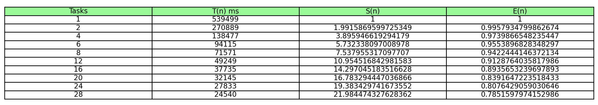

# pareuler
This is an university project for Distributed Software Architectures course at FMI, Sofia University.

Prerequisites
-------------------------------------------------------------
```
pip install -r requirements.txt
```

The problem
-------------------------------------------------------------

One important number for mathematics is the Euler number, i.e. the number *e*.
Using convergent rows, we can calculate the value of *e* with arbitrarily high accuracy. One of the relatively fast descending to *e* rows is

```∑(2k+1)/(2k)! , k = 0,...,∞```

Write a program for calculating the number *e* using the above line,
which uses parallel processes (threads) and provides the calculation of e with a set of user accuracy. The requirements for the program are to support the following parameters:
```
-t <NUMBER>     maximum number of threads 
-p <NUMBER>     either precision or the kth member of the serie
-o <FILE>       output file
-q              quiet mode
```

The solution
--------------------------------------------------------------

One of the big obstacles in Python: the Global Interpreter Lock (known as GIL). GIL limits all Python code to running on a single processor, so Python multithreaded applications are very useful only when there is a lot of waiting for I / O.
The multiprocessing package in Python offers both local and remote concurrency, effectively side-stepping the Global Interpreter Lock by using subprocesses instead of threads. Due to this, the multiprocessing module allows the programmer to fully leverage multiple processors on a given machine.
Static scheduling makes a scheduling decision at compile-time and uniformly distributes loop iterations onto processors. 
2 different algorithms for static scheduling of the data have been tested as part of the solution.

1. Block scheduling - unscalable

First algorithm in `opt1.py` applies the static block scheduling as part of the data parallelism. In block scheduling, N iterations are divided into N/P rounds. Each round consists of consecutive iterations and is assigned to one processor. This is only suitable for uniformly distributed loop iterations.


2. Cyclic scheduling - scalable

Second algorithm in `opt2.py` applies the static cyclic scheduling as part of the data parallelism.
Instead of assigning to a processor a consecutive block of iterations,
iterations are assigned to different processors in a cyclic fashion; i.e. iteration i is assigned to processor i mod P. This method produces more balanced schedule than block scheduling for some non-uniformly distributed parallel loops.

Results
----------------------------------------------------------------




Speed-up Ratio 
----------------------------------------------------------------


Other observations
----------------------------------------------------------------


